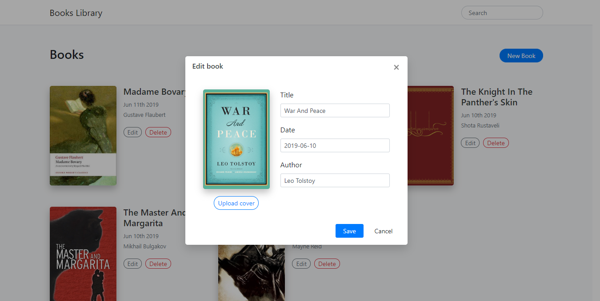

# Getting started

To run this application correctly you must run next commands in project directory:

## First install node_modules
`npm install` or `yarn install`

Note: Use latest nodejs (version 12.3.1+) with npm version of 6.8.0+

## Second: start *http-server*

### `http-server ./server --a=localhost --cors=Access-Control-Allow-Origin`

Note: http-server should run in `./server` directory with address `--a=localhost` and disabled cors `--cors=Access-Control-Allow-Origin`.
So that http-server should be available on `http://localhost:8080`

## Then start React

### `npm start`

## And you are done!

# Bonus features
* Search
* Image upload

# External libraries
* react-fontawesome - FontAwesome icons for react
* axios
* bootstrap
* classnames - Simple library for managing classNames 
* formik - Form management library
* http-server
* jquery
* moment - Cross browser date management library
* node-sass
* popper.js
* prop-types
* redux
* react-redux
* redux-thunk
* yup - Object schema validation
